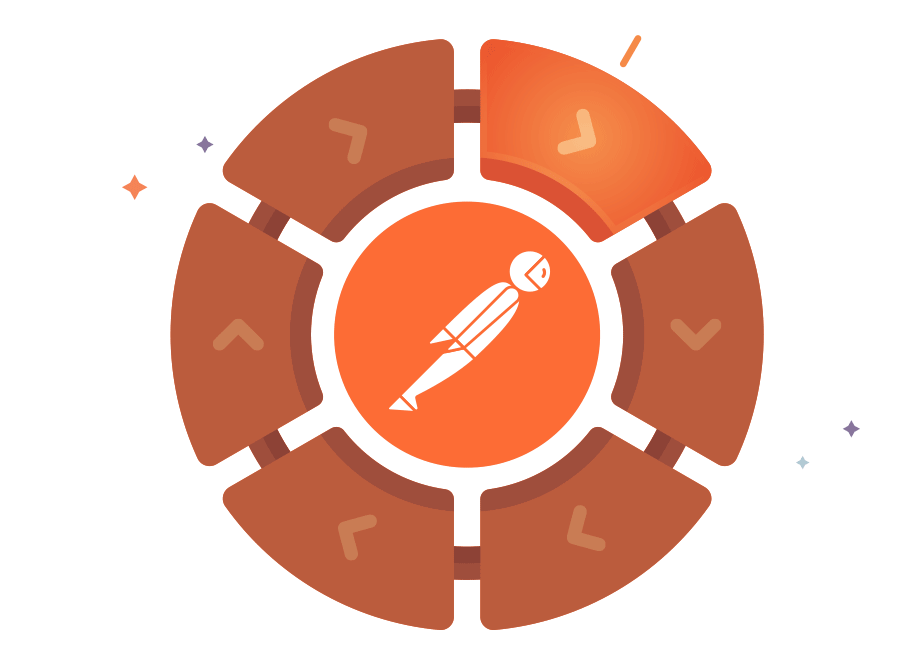

  

 

&nbsp;&nbsp;

&nbsp;&nbsp;

&nbsp;&nbsp;

&nbsp;&nbsp;

&nbsp;&nbsp;

 

<h3 align="center">👨‍💻 About Me</h3>

  I'm <b>Divyanshu Raj</b>, a <b>Full-Stack Engineer</b> who loves bridging the gap between complex backends and intuitive frontends. 
  While the <b>MERN Stack</b> is my home base, I'm actively exploring the frontiers of <b>Generative AI</b> and <b>LLMs</b>. 
  I build, I learn, and I share—constantly striving to create software that matters.

 

<h3 align="center">🛠️ Tools & Technologies</h3>

<table align="center">
  <tr>
    <td align="center" width="96">
      
       Python
    </td>
    <td align="center" width="96">
      
       Java
    </td>
    <td align="center" width="96">
      
       Javascript
    </td>
    <td align="center" width="96">
      
       HTML
    </td>
    <td align="center" width="96">
      
       CSS
    </td>
  </tr>
  <tr>
    <td align="center" width="96">
      
       React
    </td>
    <td align="center" width="96">
      
       Redux
    </td>
    <td align="center" width="96">
      
       NodeJS
    </td>
    <td align="center" width="96">
      
       Express
    </td>
    <td align="center" width="96">
      
       MongoDB
    </td>
  </tr>
  <tr>
    <td align="center" width="96">
      
       MySQL
    </td>
    <td align="center" width="96">
      
       Git
    </td>
    <td align="center" width="96">
      
       Postman
    </td>
    <td align="center" width="96">
      
       Figma
    </td>
    <td align="center" width="96">
      
       Arduino
    </td>
  </tr>
</table>