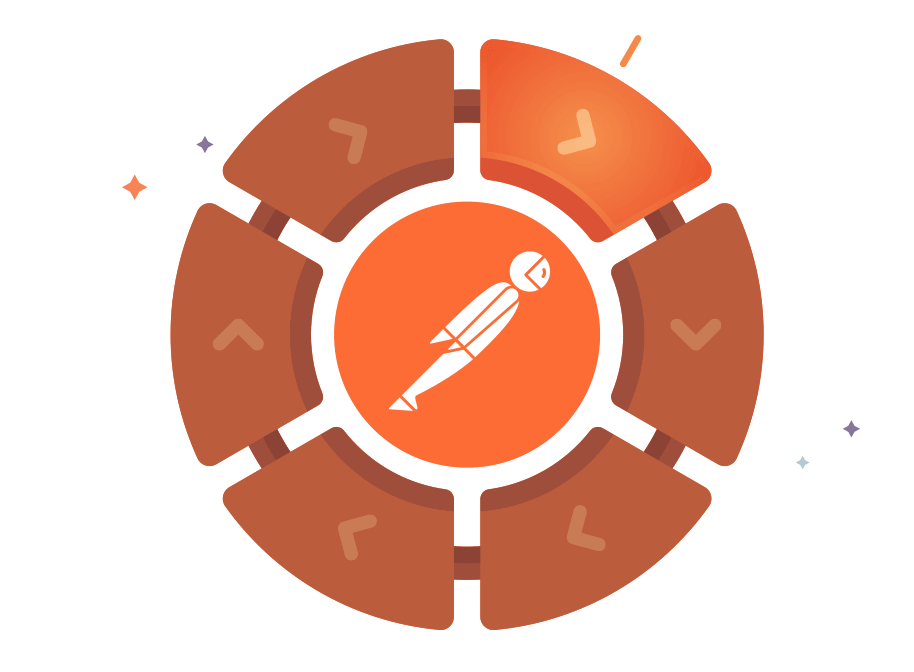

  

<h3 align="center">About Me</h3>

  I'm <b>Divyanshu Raj</b>, a <b>Full Stack Developer</b> specializing in the <b>MERN Stack (MongoDB, Express.js, React, Node.js)</b> and <b>AI/ML</b>. 
  I build scalable web applications, explore <b>Generative AI</b> and <b>LLMs</b>, and work on real-world impactful projects. 
  Passionate about open source, system design, and modern web technologies.

 
<h3 align="center">🌐 Connect with Me</h3>

<a href="https://rajdivyanshu.in">🌍 Portfolio</a> |
<a href="https://linkedin.com/in/div02raj">💼 LinkedIn</a> |
<a href="https://dev.to/divyanshuraj">🧑‍💻 Dev.to</a> |
<a href="https://medium.com/@divyanshuraj_">✍️ Medium</a>

 

<h3 align="center">Core Tech Stack</h3>

<table align="center">
  <tr>
    <td align="center" width="96">
      
       Python
    </td>
    <td align="center" width="96">
      
       Java
    </td>
    <td align="center" width="96">
      
       JavaScript
    </td>
    <td align="center" width="96">
      
       React
    </td>
    <td align="center" width="96">
      
       Node.js
    </td>
  </tr>
  <tr>
    <td align="center" width="96">
      
       Express
    </td>
    <td align="center" width="96">
      
       MongoDB
    </td>
    <td align="center" width="96">
      
       MySQL
    </td>
    <td align="center" width="96">
      
       Git
    </td>
    <td align="center" width="96">
      
       Postman
    </td>
  </tr>
</table>
 
<h3 align="center">🚀 Featured Projects</h3>

  🔹 <b><a href="https://github.com/divyanshu02raj/Smart-Resume-Screener">Smart Resume Screener</a></b> – AI-powered resume analysis using Gemini API with real-time evaluation and insights. 
  🔹 <b><a href="https://github.com/divyanshu02raj/course-marketplace">Course Marketplace</a></b> – A full-stack e-learning marketplace built on the MERN stack. 
  🔹 <b><a href="https://github.com/divyanshu02raj/IoT-Temperature-Humidity-Monitor">IoT Monitoring System</a></b> – ESP8266-based real-time temperature & humidity monitoring with cloud dashboard.

 
<h3 align="center">📊 GitHub Stats</h3>

 

  <picture>
    <source 
      srcset="https://github-readme-streak-stats.herokuapp.com/?user=divyanshu02raj&theme=dark"
      media="(prefers-color-scheme: dark)" />
    <source 
      srcset="https://github-readme-streak-stats.herokuapp.com/?user=divyanshu02raj&theme=default"
      media="(prefers-color-scheme: light)" />
    
  </picture>

 
<h3 align="center">⚡ Currently Working On</h3>

  🔹 Building AI-powered applications  
  🔹 Improving system design & backend architecture  
  🔹 Exploring Generative AI and LLMs

 
<h3 align="center">🔍 About Divyanshu Raj</h3>

Divyanshu Raj is a Full Stack Developer and AI/ML enthusiast from India. He specializes in MERN stack development, builds scalable web applications, and works on real-world AI-powered projects.

 

  Built and maintained by <b>Divyanshu Raj</b>

